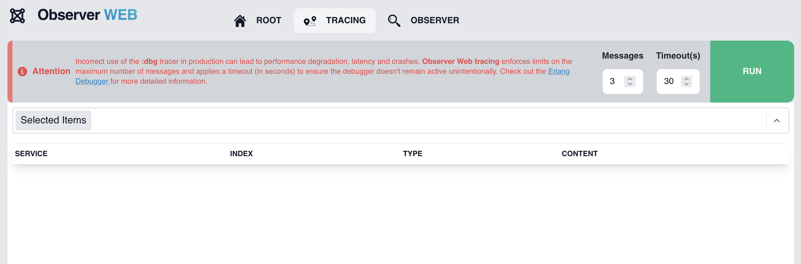

[](https://hex.pm/packages/observer_web)

# Observer Web

Observer Web is an easy-to-use tool that integrates into your application to provide observability for processes, ports, and tracing using the [Erlang debugger][edb]. It supports running tracing and observer functions for both the local node and any other connected nodes. Powered by [Phoenix LiveView][liv], it is distributed, lightweight, and fully real-time. This library is part of the [DeployEx][dye] project.

A preview of the Dashboard



## Installation in your App

See the [installation guide](https://hexdocs.pm/observer_web/installation.html) for details on installing and Configuring.

## Running Observer Web as standalone (for testing and development)

### Download dependencies
```
mix deps.get
```

### Fetch and Compile assets
```
mkdir -p priv/static && touch priv/static/app.css && touch priv/static/app.js
cd assets/
npm install
cd ..
mix assets.build
```

### Run the application for development

Since Observer Web uses the OTP distribution, it is required to have a name when running.
```
elixir --sname hello -S mix run --no-halt dev.exs
```

Now you can visit [`localhost:4000/observer`](http://localhost:4000/observer) from your browser.


[dye]: https://github.com/thiagoesteves/deployex
[edb]: https://www.erlang.org/doc/apps/runtime_tools/dbg.html
[liv]: https://github.com/phoenixframework/phoenix_live_view
