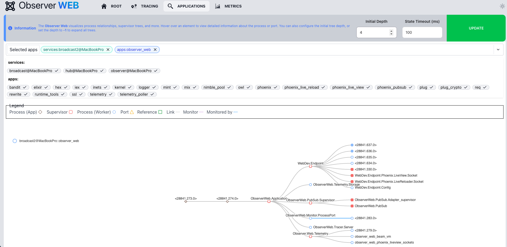

[](https://hex.pm/packages/observer_web)

# Observer Web

Observer Web is an easy-to-use tool that integrates into your application, providing
enhanced observability. Leveraging OTP distribution, it offers tracing through the
[Erlang debugger][edb], along with detailed insights into process/port statuses
and Beam VM statistics.

Powered by [Phoenix LiveView][liv], it is distributed, lightweight, fully real-time and __safe to use in production__. This
library is part of the [DeployEx][dye] project.

## Check out some of the available features

### Distributed tracing safe to use in production


### Application topology view with processes, ports, references, links and relations.


### Process inspector with actions (send messages, kill, GC, memory monitoring)


### LiveView-specific debugging and state inspection


### Port inspector with close and memory monitoring capabilities


### Real-time VM metrics across all distributed nodes


## Installation in your App

See the [installation guide](https://hexdocs.pm/observer_web/installation.html) for details on installing and Configuring.

## Running Observer Web as standalone (for testing and development)

### Download dependencies

```console
mix deps.get
```

### Fetch and Compile assets

```console
mkdir -p priv/static && touch priv/static/app.css && touch priv/static/app.js
cd assets/
npm install
cd ..
mix assets.build
```

### Run the application for development

Since Observer Web uses the OTP distribution, it is required to have a name when running.

```console
elixir --sname observer -S mix run --no-halt dev.exs
```

Now you can visit [`localhost:4000/observer`](http://localhost:4000/observer) from your browser.

### Run multiple nodes with Metric Hub configuration

1. Start the nodes

Open a new terminal (Terminal 1) and run the application in `observer` mode:

```console
export PORT=4000
export OBSERVER_WEB_TELEMETRY_MODE=observer
elixir --sname observer --cookie cookie -S mix run --no-halt dev.exs
```

Open a new terminal (Terminal 2) and run the application in `broadcast` mode:

```console
export PORT=4001
export OBSERVER_WEB_TELEMETRY_MODE=broadcast
elixir --sname broadcast --cookie cookie -S mix run --no-halt dev.exs
```

2. Connect the nodes

Open a new terminal (Terminal 3) and run:

```console
iex --sname hub --cookie cookie -S mix phx.server
```

After the Phoenix server starts, you'll see the Elixir interactive shell prompt. Connect
the nodes by executing these commands:

```elixir
# Connect to the observer node
{:ok, hostname} = :inet.gethostname()
Node.connect(:"observer@#{hostname}")
# Should return: true

# Connect to the broadcast node
{:ok, hostname} = :inet.gethostname()
Node.connect(:"broadcast@#{hostname}")
# Should return: true
```

You can close the Terminal 3 if you want, this terminal is only for supporting the node connection.

To verify everything is working properly:

- Visit [`localhost:4000/observer/metrics`](http://localhost:4000/observer/metrics) in your browser to confirm
  the application is running in `observer` mode.
- Visit [`localhost:4001/observer/metrics`](http://localhost:4001/observer/metrics) to confirm the application
  is running in `broadcast` mode.

You can now explore the `observer` mode, checking that the data is persisted even if the other app in
broadcast mode restarts.

[dye]: https://github.com/thiagoesteves/deployex
[edb]: https://www.erlang.org/doc/apps/runtime_tools/dbg.html
[liv]: https://github.com/phoenixframework/phoenix_live_view
