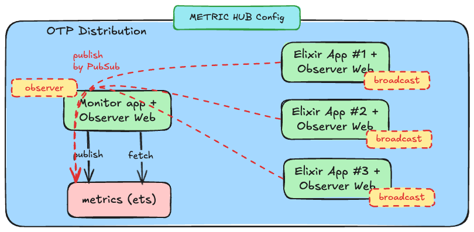

# Installation

Observer Web is delivered as a hex package named `observer_web`. The package is entirely self contained—it
doesn't hook into your asset pipeline.

There are three installation mechanisms available:

- [Semi-Automatic Installation](#semi-automatic-installation) using an igniter powered mix task
- [Igniter Installation](#igniter-installation) fully automatic installation using igniter
- [Manual Installation](#manual-installation) add Observer Web and handle all steps manually

## Semi-Automatic Installation

You can use the `observer_web.install` task without the `igniter.install` escript available.
First, add `observer_web` and `igniter` to your deps in `mix.exs`:

```elixir
{:observer_web, "~> 0.2.0"},
{:igniter, "~> 0.5", only: [:dev]},
```

Run `mix deps.get` to fetch `observer_web`, then run the install task:

```bash
mix observer_web.install
```

This will automate all of the manual setup steps for you!

## Igniter Installation

For projects that have [igniter][igniter] available, Observer Web can be installed and configured with
a single command:

```bash
mix igniter.install observer_web
```

that will add the latest version of `observer_web` to your dependencies before running the installer,
then mount it as `/observer` within the `:dev_routes` conditional.

## Manual Installation

Before installing Observer Web, ensure you have:

1. **Phoenix Live View** - Ensure [Phoenix Live View][plv] is installed and working. If you
  don't have Live View yet, follow [these instructions][lvi].

Add `observer_web` as a dependency for your application. Open `mix.exs` and add the following line:

```elixir
{:observer_web, "~> 0.2.0"}
```

Now fetch your dependencies:

```bash
mix deps.get
```

This will fetch `observer_web`.

After fetching the package you'll use the `Observer.Web.Router` to mount the dashboard within your
application's `router.ex`:

```elixir
# lib/my_app_web/router.ex
use MyAppWeb, :router

import Observer.Web.Router

...

scope "/" do
  pipe_through :browser

  observer_dashboard "/observer"
end
```

Here we're using `"/observer"` as the mount point, but it can be anywhere you like. See the
`Observer.Web.Router` docs for additional options.

### Embedding Observer Web in your app page

In some cases, you may prefer to run the Observer in the same page as your app rather than in 
a separate page. This embedded approach is possible by setting the iframe flag. To implement 
this, your router must add a root path. Here's an example for your application's `router.ex`:

```elixir
# lib/my_app_web/router.ex
use MyAppWeb, :router

import Observer.Web.Router

...

scope "/" do
  pipe_through :browser

  live_session :require_authenticated_user,
    on_mount: [{MyAppWeb.UserAuth, :ensure_authenticated}] do
    ...
    live "/embedded-observer", ObserverLive, :index
    ...
  end
  
  observer_dashboard "/observer"
end
```

Next, create an ObserverLive file at `live/observer/index.ex`:

```elixir
defmodule MyAppWeb.ObserverLive do
  @moduledoc """
  """
  use MyAppWeb, :live_view

  @impl true
  def render(assigns) do
    ~H"""
    <div>
      <iframe src={~p"/observer/tracing?iframe=true"} class="min-h-screen" width="100%" height="100%" title="Observer Web">
      </iframe>
    </div>
    """
  end

  @impl true
  def mount(_params, _session, socket) do
    {:ok, socket}
  end

  @impl true
  def handle_params(params, _url, socket) do
    {:noreply, apply_action(socket, socket.assigns.live_action, params)}
  end

  defp apply_action(socket, :index, _params) do
    socket
    |> assign(:page_title, "Observer Web")
  end
end
```

You can still access the Observer as a separate page by navigating directly to the 
path `/observer"`. However, using the iframe approach allows you to display 
your application's information alongside the Observer in your main page, 
providing a more integrated monitoring experience.

> ## Clustering Required {: .info}
>
> The Observer Web **requires your app to be clustered**. Otherwise, observability will only be 
> available on the current node.

## Post-Installation

After installation (by any method), you should consider the following configuration steps:

### Secure Dashboard Access

After you've verified that the dashboard is loading you'll probably want to restrict access to the
dashboard via authentication, either with a [custom resolver's][ac] access controls or [Basic
Auth][ba].

### Customize the Dashboard

Web customization is done through the `Observer.Web.Resolver` behaviour. It allows you to enable
access controls, control formatting, and provide query limits for filtering and searching. Using a
custom resolver is optional, but you should familiarize yourself with the default limits
and functionality.

### Metrics

#### 1. Retention period for metrics

Observer Web can monitor Beam VM metrics (along with many others) and uses ETS 
tables to store the data and there is a possibility of configuration for the retention
period while the application is running.

By default, without a retention time set, the metrics will only show data received during the
current session. If you'd like to persist this data for a longer period, you can configure
a retention time.

To configure the retention period, use the following optional setting:

```elixir
config :observer_web,
  data_retention_period: :timer.minutes(30)
```

> #### Persistence Across Restarts {: .attention}
>
> Please note that data is not persisted across application restarts. For persistent
> storage, refer to the Configuration section to set up a Central Hub application,
> which can aggregate and retain metrics.

#### 2. Configuration

Observer Web can operate in two distinct metrics configurations: `Standalone` and `Metric Hub`.
These configurations determine how metrics are collected, stored, and managed.

##### Standalone Configuration (default)

In this mode, all applications with Observer Web installed operate independently. Each
application receives and stores its own metrics within its ETS tables. The image below
illustrates this configuration:


__**NOTE: No additional configuration is required for this mode**__

##### Metric Hub Configuration

In this mode, one application is designated as the central hub to store all metrics,
while the remaining applications broadcast their data to this designated hub. This
configuration is ideal for scenarios where you have a dedicated application for monitoring
or deployment, such as [DeployEx][dye]. Additionally, this setup ensures that metrics
are retained even if any of the monitored applications restart.



To configure applications to broadcast their metrics, use the following setting:

```elixir
config :observer_web,
  mode: :broadcast
```

> #### Disable Endpoint for Broadcast applications {: .attention}
>
> In this mode, since there is a centralized application dedicated to capturing metrics,
> we recommend disabling the `/observer` endpoint on all applications configured in 
> **broadcast** mode. Only the **central observer (hub)** should expose the `/observer` endpoint
> to avoid redundancy and ensure efficient metric collection.

To designate an application as the **central observer (hub)**, use the following setting:

```elixir
config :observer_web,
  mode: :observer,
  data_retention_period: :timer.minutes(30)
```

The application in `observer mode` will also retain its own metrics in addition to 
aggregating metrics from other applications.

#### 3. Metrics Polling Interval

Observer Web allows configuration of some polling intervals:
 * Phoenix Liveview sockets - Default: `5_000` ms
 * Beam VM statistics (total memory, queues, etc) - Default: `1_000` ms
 * Beam VM Process/Port memory statistics (total, stack, heap, etc) - Default: `1_000` ms

```elixir
config :observer_web,
  phx_lv_sckt_poller_interval_ms: 5_000,
  beam_vm_poller_interval_ms: 1_000
  beam_vm_process_port_poller_interval_ms: 1_000
```

> #### For applications running by [DeployEx][dye] {: .attention}
>
> When using DeployEx, the BEAM VM statistics polling is also used to monitor and, if necessary, restart the application. The polling interval directly affects how quickly these actions are performed. While ports, atoms, and processes are configured via Observer Web, the memory check interval (also used by [DeployEx][dye]) is configured separately—refer to the relevant [documentation][mtc] for details.

### Usage with Web and Clustering

The Observer Web provides observer ability for the local application as well as any other that is
clustered.

## Customization

Web customization is done through the `Observer.Web.Resolver` behaviour. It allows you to enable
access controls. Using a custom resolver is entirely optional, but you should familiarize yourself
with the default limits and functionality.

Installation is complete and you're all set! Start your Phoenix server and enjoy the observability
via OTP distribution!

[plv]: https://github.com/phoenixframework/phoenix_live_view
[lvi]: https://github.com/phoenixframework/phoenix_live_view#installation
[ac]: Observer.Web.Resolver.html#c:resolve_access/1
[ba]: https://hexdocs.pm/basic_auth/readme.html
[oi]: installation.html
[dye]: https://github.com/thiagoesteves/deployex
[mtc]: https://hexdocs.pm/telemetry_metrics/Telemetry.Metrics.html