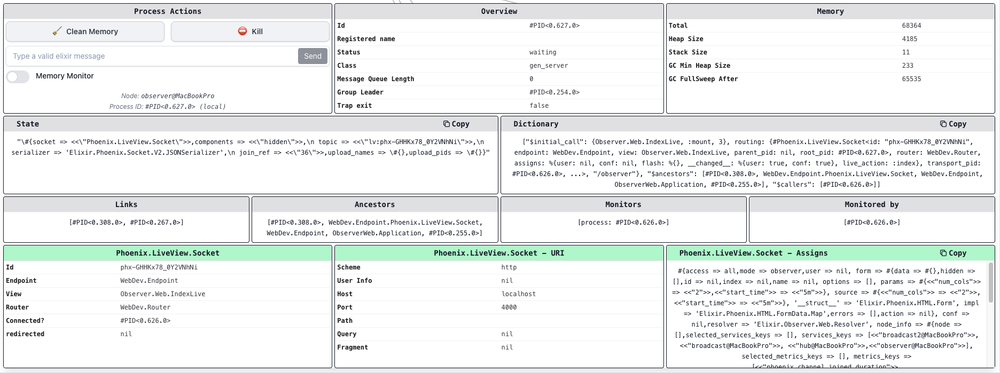
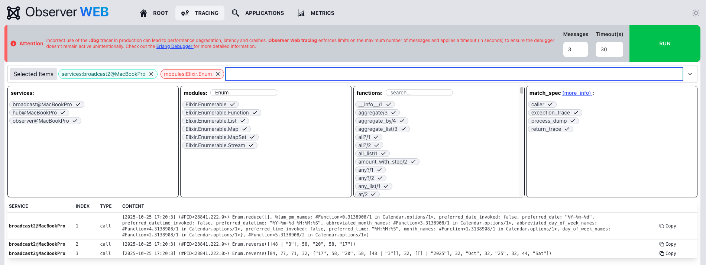
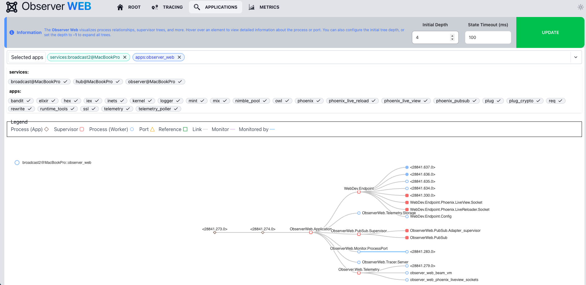
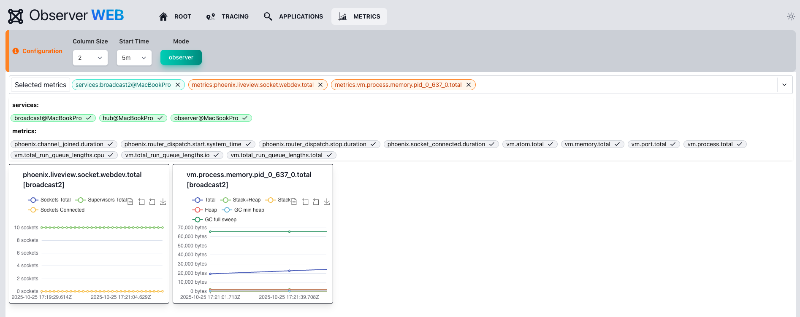

# Overview

Observer Web is an easy-to-use tool that integrates into your application, providing 
enhanced observability. Leveraging OTP distribution, it offers tracing through the 
[Erlang debugger][edb], along with detailed insights into process/port statuses 
and Beam VM statistics.

Powered by [Phoenix LiveView][liv], it is distributed, lightweight, and fully real-time. This 
library is part of the [DeployEx][dye] project.

[dye]: https://github.com/thiagoesteves/deployex
[edb]: https://www.erlang.org/doc/apps/runtime_tools/dbg.html
[liv]: https://github.com/phoenixframework/phoenix_live_view

## Features

- **🐦‍🔥 Embedded LiveView** - Mount the dashboard directly in your application without any
external dependencies.

- **🔍 Real Time Tracing** - Trace any function within your application, capturing parameters passed
and also function callers, as many other possibilities.

- **🔬 Process/Port Inspection** - View processes and ports details as well as their status and 
connectivity (and much more).

- **📊 Realtime VM Metrics** - Powered by ets table and OTP 
distribution, vm memory statistics are stored and easily filtered.

- **🖼️ Embedded Mode** - Observer Web can be run using iframes, seamlessly integrating the 
observability experience within your application.

## Installation

See the [installation guide](installation.md) for details on installing and configuring Observer Web
for your application.
