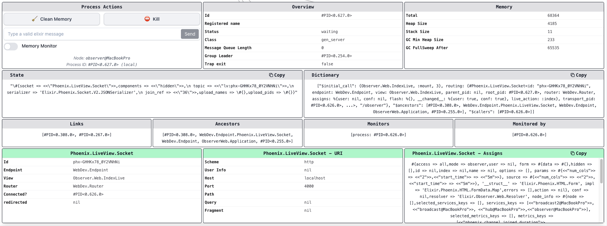
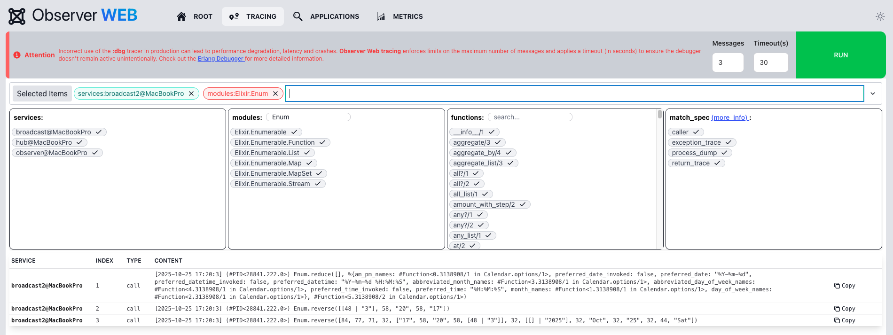
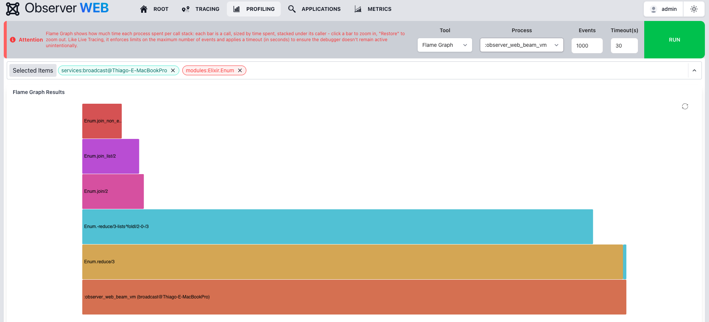
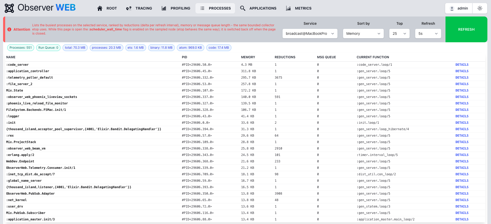
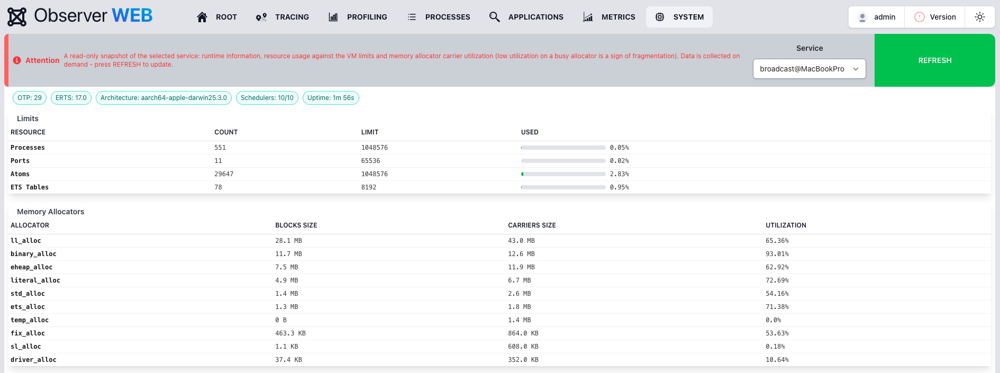
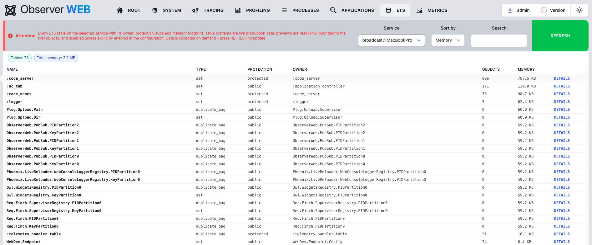
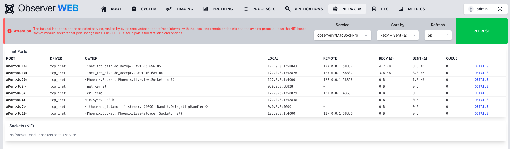
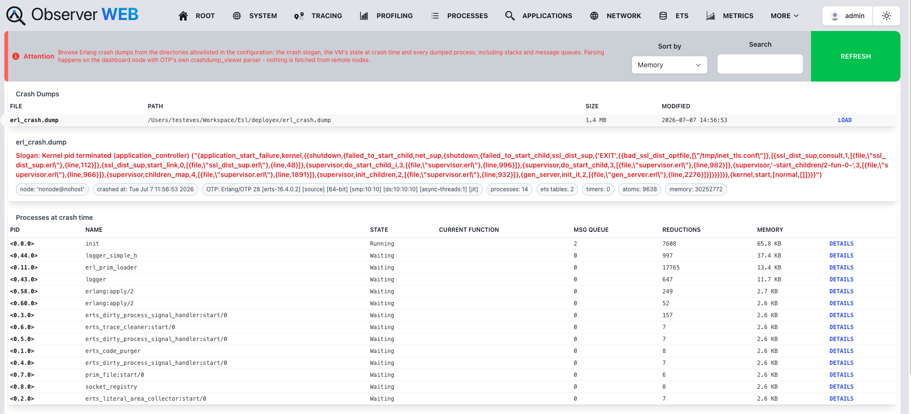
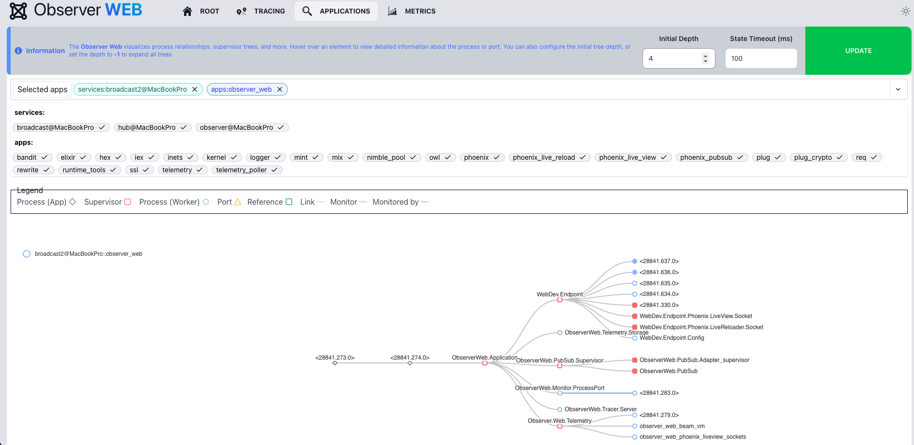
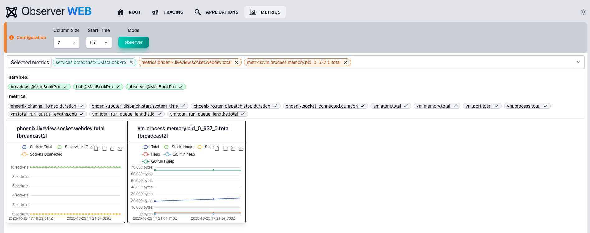

# Overview

Observer Web is an easy-to-use tool that integrates into your application, providing 
enhanced observability. Leveraging OTP distribution, it offers tracing and profiling 
through the [Erlang debugger][edb], along with detailed insights into process/port 
statuses and Beam VM statistics.

Powered by [Phoenix LiveView][liv], it is distributed, lightweight, fully real-time and __safe to use in production__. This
library is part of the [DeployEx][dye] project.

[dye]: https://github.com/thiagoesteves/deployex
[edb]: https://www.erlang.org/doc/apps/runtime_tools/dbg.html
[liv]: https://github.com/phoenixframework/phoenix_live_view

## Features

- **🐦‍🔥 Embedded LiveView** - Mount the dashboard directly in your application without any
external dependencies.

- **🔍 Real Time Tracing** - Trace any function within your application, capturing parameters passed
and also function callers, as many other possibilities.

- **🔥 Function Profiling** - Aggregate traced calls into a report instead of a live stream:
call counts, durations (sum, average, min, max or a distribution histogram), per-process
call sequence trees and flame graphs, all with the same production-safe limits as tracing.

- **📋 Process Top** - The busiest processes on any node, etop style: ranked by reductions
per interval, memory or message queue length, with a drill-down into each process's status,
stacktrace, links and more.

- **🧮 System Snapshot** - Runtime information, resource usage against the VM limits
(processes, ports, atoms, ETS tables) and memory allocator carrier utilization, plus an
opt-in scheduler utilization time series in the Metrics dashboard.

- **🗄️ ETS & Mnesia Browser** - Every ETS or Mnesia table on any node with owner,
protection/storage, type and memory footprint, searchable and sortable - plus opt-in,
read-only, bounded content previews.

- **🌐 Network** - The busiest inet ports on any node ranked by bytes received/sent per
interval, with local/remote endpoints, owning process, full statistics and socket options -
plus the NIF-based socket module sockets that port listings miss.

- **💥 Crash Dump Browser** - Upload an `erl_crash.dump` from your machine, or open one from
an allowlisted directory on the host, then read the crash slogan, the VM's state at crash time
and every dumped process - stacks and message queues included - parsed with OTP's own
crashdump_viewer. Off by default; enabled with `config :observer_web, crashdump: true`.

- **🔬 Process/Port Inspection** - View processes and ports details as well as their status and 
connectivity (and much more), with a per-application summary table: process/port counts,
version and on-demand memory/reductions totals.

- **📊 Realtime VM Metrics** - Powered by ets table and OTP 
distribution, vm memory statistics are stored and easily filtered.

- **🖼️ Embedded Mode** - Observer Web can be run using iframes, seamlessly integrating the 
observability experience within your application.

## Installation

See the [installation guide](installation.md) for details on installing and configuring Observer Web
for your application.
